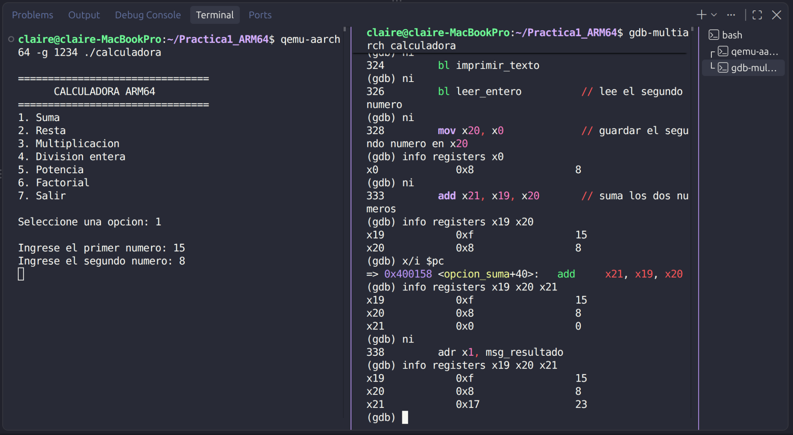
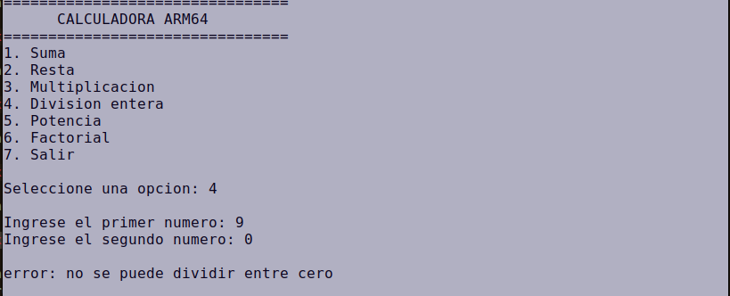
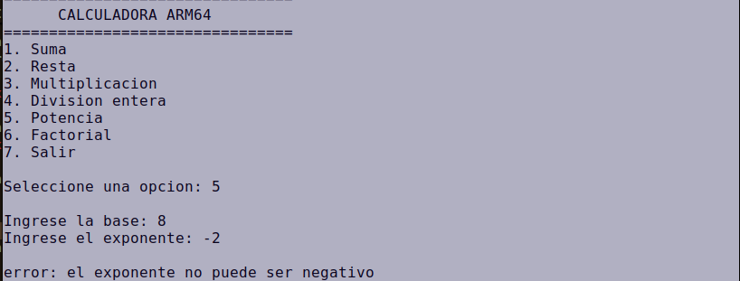
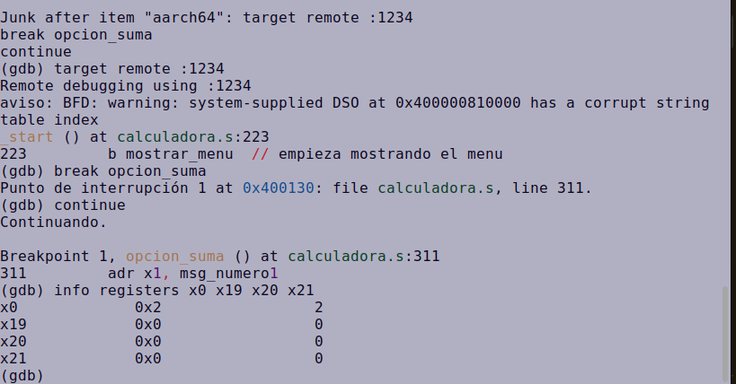

# CALCULADORA DE NUMEROS ENTEROS EN ENSAMBLADOR ARM64

## 1. INTRODUCCION

La presente practica consistio en desarrollar una calculadora de numeros enteros utilizando lenguaje ensamblador ARM64. El programa fue ejecutado desde consola y permitio realizar operaciones aritmeticas mediante un menu interactivo.

Durante el desarrollo se utilizaron instrucciones de procesamiento de datos, comparaciones, saltos condicionales, ciclos y llamadas a subrutinas. Tambien fue necesario trabajar con entrada y salida por consola, conversion de caracteres ASCII a valores numericos y conversion de resultados numericos a texto para mostrarlos al usuario.

La solucion se desarrollo completamente en ensamblador ARM64 y se ejecuto utilizando las herramientas GNU para AArch64 y QEMU.

---

# 2. OBJETIVOS

## 2.1 OBJETIVO GENERAL

Desarrollar una calculadora de numeros enteros en ensamblador ARM64 que permita aplicar los conceptos de programacion a bajo nivel mediante operaciones aritmeticas, control de flujo, ciclos, validaciones y subrutinas.

## 2.2 OBJETIVOS ESPECIFICOS

- implementar un menu interactivo en consola
- realizar suma, resta, multiplicacion y division entera
- implementar potencia mediante multiplicacion repetida
- implementar factorial mediante un ciclo iterativo
- validar operaciones no permitidas
- utilizar subrutinas para organizar el programa
- utilizar gdb para comprobar registros y flujo de ejecucion

---

# 3. DESCRIPCION DEL PROGRAMA

La aplicacion muestra un menu con siete opciones:

```text
1. Suma
2. Resta
3. Multiplicacion
4. Division entera
5. Potencia
6. Factorial
7. Salir
```

El usuario selecciona una opcion e ingresa los valores solicitados.

Al finalizar una operacion, el programa muestra el resultado y vuelve al menu principal.

---

# 4. OPERACIONES IMPLEMENTADAS

## 4.1 SUMA

La suma utiliza la instruccion:

```asm
add x21, x19, x20
```

El primer operando se almacena en x19, el segundo en x20 y el resultado en x21.

---

## 4.2 RESTA

Se utiliza:

```asm
sub x21, x19, x20
```

La operacion permite obtener resultados positivos o negativos.

---

## 4.3 MULTIPLICACION

Se utiliza:

```asm
mul x21, x19, x20
```

---

## 4.4 DIVISION ENTERA

La division utiliza:

```asm
sdiv x21, x19, x20
```

Se utiliza division con signo para permitir operandos negativos.

Antes de realizar la division se valida que el divisor no sea cero.

---

## 4.5 POTENCIA

La potencia fue implementada mediante multiplicacion repetida.

Ejemplo para `2^4`:

```text
1 * 2 = 2
2 * 2 = 4
4 * 2 = 8
8 * 2 = 16
```

El ciclo utiliza:

```asm
mul x21, x21, x19
sub x22, x22, #1
```

---

## 4.6 FACTORIAL

El factorial fue implementado mediante un ciclo iterativo.

Ejemplo:

```text
5! = 5 * 4 * 3 * 2 * 1 = 120
```

El ciclo utiliza:

```asm
mul x20, x20, x21
sub x21, x21, #1
```

---

# 5. VALIDACIONES

## 5.1 OPCION INVALIDA

Las opciones que se encuentran fuera del rango del menu son rechazadas.

Ejemplo:

```text
opcion invalida, intente nuevamente
```

---

## 5.2 DIVISION ENTRE CERO

Antes de realizar la division se comprueba el divisor:

```asm
cmp x20, #0
b.eq error_division
```

Mensaje:

```text
error: no se puede dividir entre cero
```

---

## 5.3 EXPONENTE NEGATIVO

La potencia solamente acepta exponentes enteros no negativos.

```asm
cmp x20, #0
b.lt error_exponente
```

---

## 5.4 FACTORIAL NEGATIVO

El factorial solo acepta numeros enteros no negativos.

```asm
cmp x19, #0
b.lt error_factorial
```

---

# 6. ENTRADA Y SALIDA

La entrada del teclado llega en forma de caracteres ASCII.

Por esta razon se implemento una rutina encargada de convertir los caracteres a un numero entero.

Tambien se implemento una rutina para convertir los resultados numericos nuevamente a caracteres para poder imprimirlos en consola.

---

# 7. HERRAMIENTAS UTILIZADAS

- Linux
- GNU Assembler para AArch64
- GNU Linker
- QEMU AArch64
- GDB Multiarch
- terminal
- editor de codigo

---

# 8. COMPILACION Y EJECUCION

Ensamblar:

```bash
aarch64-linux-gnu-as -g -o calculadora.o calculadora.s
```

Enlazar:

```bash
aarch64-linux-gnu-ld -o calculadora calculadora.o
```

Ejecutar:

```bash
qemu-aarch64 ./calculadora
```

---
###  SECCIONES DEL PROGRAMA

### `.section .data`

Contiene datos inicializados.

Ejemplos:

- menu
- mensajes
- textos de error
- `Resultado:`

### `.section .bss`

Reserva memoria para datos que se utilizan durante la ejecucion.

Ejemplos:

```text
buffer_opcion
buffer_numero
buffer_salida
```

### `.section .text`

Contiene el codigo ejecutable.

---
### SYSCALLS UTILIZADAS

| syscall | numero | uso |
|---|---:|---|
| read | 63 | leer teclado |
| write | 64 | imprimir |
| exit | 93 | terminar programa |

---

## REGISTROS IMPORTANTES

| registro | uso |
|---|---|
| x0 | argumentos, resultados y syscalls |
| x1 | direcciones de memoria |
| x2 | cantidad de bytes |
| x8 | numero de syscall |
| x19 | primer operando o valor principal |
| x20 | segundo operando o resultado segun operacion |
| x21 | resultado o contador segun operacion |
| x22 | contador de potencia |

---

### ENSAMBLAR

```bash
aarch64-linux-gnu-as -g -o calculadora.o calculadora.s
```

---

### ENLAZAR

```bash
aarch64-linux-gnu-ld -o calculadora calculadora.o
```

---

### EJECUTAR

```bash
qemu-aarch64 ./calculadora
```
# 9. DEPURACION CON GDB

Para realizar la depuracion se inicio QEMU en modo remoto:

```bash
qemu-aarch64 -g 1234 ./calculadora
```

En una segunda terminal se inicio:

```bash
gdb-multiarch calculadora
```

Se configuro:

```gdb
set architecture aarch64
target remote :1234
break opcion_suma
continue
```

Durante una suma de `15 + 8`, se observaron los siguientes registros:

```text
x19 = 15
x20 = 8
```

Despues de ejecutar:

```asm
add x21, x19, x20
```

se obtuvo:

```text
x21 = 23
```

Esto permitio comprobar directamente el funcionamiento de la operacion en los registros del procesador.

## Captura



---

# 10. EVIDENCIAS

## evidencia 1 - menu principal


## evidencia 2 - suma


## evidencia 3 - resta


## evidencia 4 - multiplicacion


## evidencia 5 - division


## evidencia 6 - validacion de division entre cero



## evidencia 7 - potencia


## evidencia 8 - validacion de exponente negativo


## evidencia 9 - factorial


## evidencia 10 - factorial negativo


## evidencia 11 - opcion invalida


## evidencia 12 - gdb


---

# 11. CONCLUSIONES

1. El desarrollo de la calculadora permitio aplicar instrucciones aritmeticas de ARM64 y comprender la forma en que los operandos y resultados son almacenados en registros.

2. El uso de comparaciones y saltos condicionales permitio implementar las validaciones necesarias para controlar operaciones no permitidas, como la division entre cero y el uso de numeros negativos en potencia y factorial.

3. La implementacion de potencia y factorial permitio aplicar estructuras iterativas utilizando comparaciones, saltos y contadores directamente en ensamblador.

4. El uso de subrutinas facilito la organizacion del programa y permitio reutilizar procesos como la lectura de enteros, la conversion de resultados y la impresion de mensajes.

5. La depuracion con GDB permitio observar directamente el contenido de los registros y comprobar el resultado de las operaciones durante la ejecucion.
